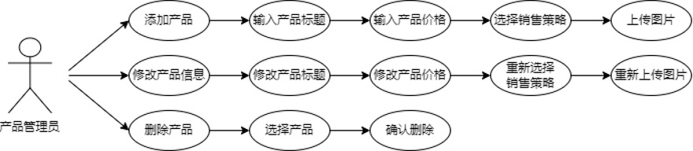
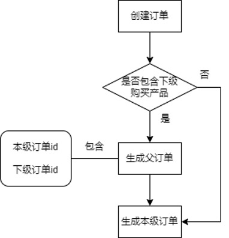
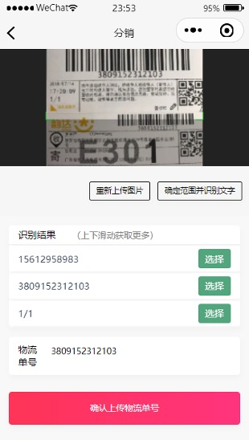

# 产品分销微信小程序

## 相关理论技术

### 微信web开发者工具

微信web开发工具是一种基于Native System系统层的框架。因为其并非在浏览器中运行，所以JavaScript在传统web开发中的一些方法，如Document，Window，都无法使用。传统的HTML5在加载过程中受网络环境影响较为明显，其需要逐步加载HTML、CSS、JS，在返回数据，最后在浏览器中进行页面的渲染并展示。而微信小程序渲染和逻辑分离的运行机制则与传统web开发有所不同。微信小程序的Appservice Thread会与View Thread同步，甚至比View Thread更早执行，等到View Thread加载完成后，通知Appservice，准备好的数据就会以setData的方法返回给View Thread。  

微信小程序的底层框架模块是基于Ne.js，使用Node.js、Chromium和系统API来实现的。其使用React、Redux等前端技术框架来构建用户交互层，实现同一套代码跨平台使用。  

### 前端开发技术

小程序前端开发框架主要由逻辑层（AppService）和视图层（View）组成。  

其中视图层基于WXML和WXSS编写，逻辑层主要使用JavaScript。WXML是微信标记语言，用于设计小程序页面的布局与内容，WXML与传统web开发的HTML相似却不同，因为虽然二者功能类似，但WXML有自己的组件和语法；WXSS是微信样式，用于设置小程序的页面样式，WXSS描述了元素应如何被渲染的问题，与传统web开发中的CSS类似，但为了更适应微信开发者的需求，WXSS还包含了尺寸单位和样式的导入；JavaScript是当今社会中应用最为广泛的脚本语言之一，在微信小程序中用于设置小程序的逻辑结构，包括实现小程序的操作功能和API的调用。  

### 云开发

- 数据库：一个既可在小程序前端操作，也能在云函数中读写的 JSON 文档型数据库
- 文件存储：在小程序前端直接上传/下载云端文件，在云开发控制台可视化管理
- 云函数：在云端运行的代码，微信私有协议天然鉴权，开发者只需编写业务逻辑代码

## 系统设计

### 系统功能模型

基于需求，可以将本分销小程序的功能总体划分为针对分销商的功能和针对生产商的功能。在分销流转体系中，生产商，主要需要提供产品，所以本微信小程序需要为其提供对产品进行信息的管理、同步产品的发货记录、管理直属分销商、发货等功能。分销商，主要需求为从上级进货、再向下级售卖产品，小程序要确保这类用户可以高效地浏览产品、添加产品至购物车、从上级分销商处进货、查看订单状态、查看或修改个人与账户信息。  

### 用户类型

生产商可细分为用户管理员、产品管理员、策略制定员与发货员，分别拥有不同的操作权限。  

1. 用户管理员主要负责所有小程序用户的基本信息与上下级关系绑定的管理。一般来说，系统会根据用户注册时输入的邀请码，绑定用户的上下级关系，而后续的上下级关系修改则由用户管理员负责。故系统主要为用户管理员提供后续管理用户之间上下级关系，以及查看、删除用户的功能。  

    

2. 产品管理员主要负责产品信息的管理。产品的基本信息包括标题、价格、图片等。系统为产品管理员提供修改产品基本信息以及添加、删除产品的功能。

    

3. 策略制定员主要负责产品销售策略的设置。销售策略体现了产品分销时，进货数量与对应折扣的关系。系统为策略制定员提供了添加、修改、删除销售策略的功能。  

    

4. 发货员主要负责产品的发货功能。当分销商下单、订单进入待发货状态时，发货员可以进行产品的发货。系统为发货员提供了查看订单详情、上传物流信息的功能。

    

分销商主要负责产品的推广与销售。系统为分销商提供浏览产品、查看购物车、管理收货地址、查看个人信息、查看订单状态等功能。

### 系统核心业务

- 产品管理
- 产品浏览与选购
- 获利计算
- 用户信息管理
- 订单管理
- 物流信息识别
  

### 系统架构设计

微信小程序的系统架构设计可以分为视图层、逻辑层和系统层（微信客户端）这三个部分。视图层根据需求渲染出小程序的页面结构。逻辑层则是事务逻辑处理的地方，又与后端云存储等服务进行交互。  

视图层和逻辑层采用双线程管理模式。这两个线程之间的通信则是通过系统层的JSBridge（Java Script Bridge）。通过使用publish和subscribe机制来进行两个线程之间的通信。而具体的实现方式就是统一封装一个WeixinJSBridge。视图层封装了WeixinJSBridge，逻辑层也同样也兼容了WeixinJSBridge的模块，而不同环境的封装的接口则不太一样。对于windows环境，主要是通过window.postMessage实现。对于IOS，则主要是通过WKWebview的window.webkit.messageHandlers.NAME.postMessage。而对于安卓，则是通过WeixinJSCore.invokeHanlder。  

用户在视图层的反馈，和逻辑层的部分状态反馈，都是通过“事件”与小程序的系统层进行交互的。当视图层的事件被触发，视图层通过事件申请调用文件、管理权限，系统层再将事件发送到逻辑层。逻辑层从视图层接受到事件，基于JS，寻找对应的函数以处理数据。获取所需数据并进行相应的处理后，变动会反馈到系统层，再由系统层反馈给视图层。  

### 系统逻辑结构设计

本产品分销微信小程序主要包括五个部分：客户端、云存储、云数据库、云函数、小程序API。小程序会在用户授权微信信息登录时，借助小程序提供的云函数，得到用户的openid，并与后台分销系统用户的数据进行匹配。如后台数据库内存在有效用户信息，则用户成功登录分销小程序，可以使用分销小程序提供的功能。用户在使用这些功能时，如浏览产品、添加产品至购物车、管理产品信息时，会触发相应的事件，触发逻辑层进行数据的处理，部分功能需要调用API实现。数据的传输、处理根据上一章节的流程在小程序内部进行通信。最终在小程序的视图层进行渲染。

### 系统功能结构设计

1. 首页

2. 购物车

3. 用户  
    3.1 个人信息  

      

    3.2 订单  

    

    3.3 物流信息识别  

    

### 数据库设计

## 产品分销小程序的实现

### 开发环境搭建

本产品分销微信小程序使用微信web开发者工具进行开发，主要使用以下三种文件类型：微信标记语言WXML（WeiXin Mark Language）、微信样式表WXSS（WeiXin Style Sheet）、小程序主体JS（JavaScript）。  

开发小程序需要在微信官方的网页上注册一个用于小程序开发者的帐号，并获取独一无二的AppID。该AppID相当于小程序平台的身份证，可以唯一标识使用者。  

其次，需要开通云开发。首次使用时，系统将为开发者自动创建专属的云环境，开发者也可另外创建一个新的云开发环境。每个云开发环境相互隔离，拥有唯一的环境 ID，包含独立的数据库实例、存储空间、云函数配置等资源；初始创建的环境自动成为默认环境；默认配额下可以创建两个环境。同时微信官方也提供了腾讯云控制台创建的云开发环境。  

拥有AppID并创建云开发环境后，就可以使用云开发环境中的云数据库、云存储和云函数等功能。云数据库可以用来存储信息，其数据以JSON的数据格式进行存储。云存储可以存储文件，如图片、视音频等。云函数是在腾讯云端运行的代码，有些官方提供的特定的函数只能在云函数里运行。

### 前端功能模块

1. 首页
   1. 滚动条
   
    

   2. 产品浏览

    
    

2. 购物车

3. 我的订单

### 后端功能模块

1. 首页
    - 产品浏览与关键词搜索
    - 产品添加与管理  
    
      
2. 购物车
    - 获利计算
    - 订单的创建及订单关系的生成  
      
3. 用户
   - 用户登录模块  
    
      
   - 用户注册及绑定上下级关系  
    
      
   - 地址管理  
      
   - 订单状态变化  
    
      
   - 物流信息识别  
    
    

## 参考文档

- [云开发文档](https://developers.weixin.qq.com/miniprogram/dev/wxcloud/basis/getting-started.html)

